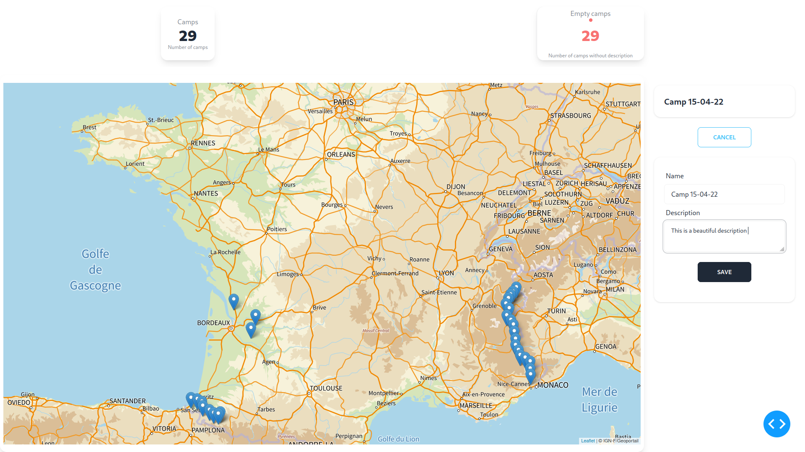

# Camp Visualizer

- [Camp Visualizer](#camp-visualizer)
  - [Installation](#installation)
    - [Prerequisites](#prerequisites)
    - [Installation Steps](#installation-steps)
  - [Usage](#usage)
    - [VSCode Tasks](#vscode-tasks)
    - [Makefile](#makefile)
  - [Usage](#usage-1)
  - [Features](#features)
  - [Configuring database](#configuring-database)
  - [Screenshots](#screenshots)
  - [Authors](#authors)
  - [Contributing](#contributing)
  - [License](#license)

[](https://app.travis-ci.com/Z3ZEL/camp-viz)
[](https://opensource.org/licenses/MIT)

Camp Visualizer is a Python application that enables users to extract and store waypoint data from GPX files. It provides a convenient way to process GPX files, extract specific points of interest, and store them either locally or in a database. Additionally, Camp Visualizer offers a web application interface that allows users to visualize the extracted waypoints and add comments to them.

## Installation

### Prerequisites

- Python3 with pip

### Installation Steps

1. Clone the repository: `git clone https://github.com/Z3ZEL/camp-viz.git`
2. Navigate to the project directory: `cd camp-viz`
3. Install dependencies: `pip install -r 'requirements.txt'`
4. Start the application: `python src/main.py`

## Usage
Two convenient ways to launch the application have been created: via **VSCode tasks** or via the **Makefile**. Here is a list of the different tasks available:

### VSCode Tasks

| Name                   | Description                                                 |
| ---------------------- | ----------------------------------------------------------- |
| Run                    | Launch the server in a web browser                          |
| Run Console            | Run the application in console mode                         |
| Update Database With GPX | Add new waypoints from a relative path GPX file to your storage (either local or database) |
| Update Requirements    | Update pip with the required modules                        |
| Run in Dev Mode        | Run the application in development mode                     |

> When running a task, you will be prompted to select the saving method. You can choose between **local** or **database**.

### Makefile

| Name         | Description                                      |
| ------------ | ------------------------------------------------ |
| web          | Run the server in a web browser                   |
| console      | Run the application in console mode               |
| update       | Update data with a GPX file                       |
| requirement  | Update pip requirements and modules               |

Example: `make web VERBOSE=1`
Run the server in a web browser with verbose mode activated.

Here is a list of all available variables:

| Name             | Description                                          |
| ---------------- | ---------------------------------------------------- |
| DISPLAY          | Select either 'web' or 'console' for the display type |
| METHOD           | Select either 'local' or 'database' for the storage mode |
| UPDATE_PATH      | Relative path of the GPX file for the update rule     |
| VERBOSE=1        | Enable verbose mode                                  |

## Usage

To begin, import your first waypoints to add them to your storage (local or database). To do this, update your storage by providing a GPX file containing waypoints and run the update command or use the `--update` argument in the console.

After that, you can run the application in either console or web mode to start visualizing your waypoints and adding descriptions to them.


## Features

- **GPX Data Extraction**: Camp Visualizer allows you to import GPX files and extract waypoints.
- **Local Storage**: You can choose to store the extracted waypoint data locally on your machine for future reference.
- **Database Integration**: Camp Visualizer provides the option to store the waypoint data in a database, allowing for efficient storage and retrieval.
- **Web Application Interface**: The web application interface allows you to visualize the extracted waypoints on a map and interact with them.
Waypoint Visualization: The web application provides a map-based view where you can see the extracted waypoints and their associated details.
- **Commenting System**: Users can add comments to specific waypoints, providing additional context or notes about each location.

## Configuring database
You need to create a `.env` file to specify database variable :
```env
PGHOST=''
PGDATABASE=''
PGUSER=''
PGPASSWORD=''
PGPORT=''

WEB_HOST='0.0.0.0'
WEB_PORT='8080'

IGN_KEY="decouverte"
```

> Moreover you need to be sure that your database has the **postgis** extension by running the following command : `CREATE EXTENSION postgis;`

Then it will update, create, modify you camps from this storage.

## Screenshots



## Authors

- Esteban Rodriguez (@Z3ZEL) - [Website](https://rodriguez-esteban.com)

## Contributing
This project is open source and designed to adding for instance new way to visualize waypoints. Feel free to make a pull request or send me an email for questions.

## License

This project is licensed under the MIT License. See the [LICENSE](LICENSE) file for details.

